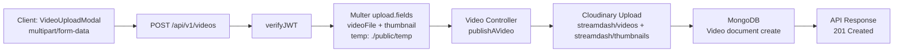

# StreamDash — Layered Monolith Video Platform

StreamDash is a full-stack video platform built as a **Layered Monolith**: one deployable backend service with clear internal separation across **Routes → Controllers → (Service Logic) → Models**, paired with a React/Vite frontend.

## Architectural Overview

### Backend architecture (Layered Monolith)

- **Routes** (`backend/src/routes`): HTTP contract, endpoint grouping, middleware composition (`verifyJWT`, `upload`).
- **Controllers** (`backend/src/controllers`): request orchestration, validation, auth checks, aggregation pipelines, response shaping.
- **Service logic**: currently embedded in controllers (token lifecycle, upload orchestration, ownership/authorization rules, aggregation workflows). This is a monolith-friendly service layer pattern without a separate `services/` directory.
- **Models** (`backend/src/models`): Mongoose schemas and data contracts.
- **Utilities/Middleware** (`backend/src/utils`, `backend/src/middlewares`): cross-cutting concerns (JWT, Multer, Cloudinary, API response/error wrappers).

### UUID relational logic on MongoDB (NoSQL)

The data model intentionally mixes Mongo-native and relational-style identifiers:

- `User._id` is a **UUID string** (`uuidv4`) instead of ObjectId.
- Cross-entity references like `Video.owner`, `Like.likedBy`, `Comment.owner`, `Comment.video` are stored as **String refs** (UUID-oriented linking).
- Aggregation pipelines use `$lookup` plus type-safe matching (`$toString` fallback where needed) to bridge mixed ID types.
- Result: **relational semantics in a NoSQL store**—explicit foreign-key-like links, app-level integrity checks, and Mongo aggregation  joins.

## Technical Stack

| Layer | Stack |
|---|---|
| Runtime / Server | Node.js + Express 5 + Mongoose |
| Frontend | React 18 + Vite 7 |
| Styling | **Tailwind CSS v4** (`@import "tailwindcss"`, `@theme` tokens) |
| Motion | **Framer Motion** (`AnimatePresence`, page wrappers, component transitions) |
| Media Pipeline | Multer (disk temp) + Cloudinary |
| Auth | JWT (cookie + bearer fallback) |
| DB | MongoDB |
| Containers | Docker + docker-compose |

> **Bun note:** the codebase is Bun-compatible at the app level, but current scripts/containers are configured with npm + Node images. A Bun runtime profile can be added as an optimization track.

## Dockerization

Current setup (`docker-compose.yml` + backend/frontend Dockerfiles) is optimized for **development**:

- bind mounts for hot reload
- `npm install` in container
- direct `npm run dev` startup

### Production multi-stage strategy (recommended)

Use multi-stage Docker builds to minimize image size and attack surface:

1. **Dependencies stage**: install only lockfile-resolved deps.
2. **Build stage**: compile frontend assets and prepare backend runtime artifacts.
3. **Runtime stage**: copy only production artifacts + prod deps into a slim base image.

**Layer optimization principles**
- Place `COPY package*.json` + install early for cache reuse.
- Copy app source after dependency layers to avoid reinstall churn.
- Exclude dev tooling from final stage.
- Keep separate frontend/backend runtime images for independent scaling.

## API Documentation (Core Domains)

Base URL: `http://localhost:8000/api/v1`

### Auth (`/users`)

| Method | Endpoint | Middleware |
|---|---|---|
| POST | `/users/register` | `upload.fields(avatar, coverImage)` |
| POST | `/users/login` | None |
| POST | `/users/logout` | `verifyJWT` |
| POST | `/users/refresh-token` | None |
| PATCH | `/users/change-password` | `verifyJWT` |
| GET | `/users/current-user` | `verifyJWT` |
| PATCH | `/users/avatar` | `verifyJWT`, `upload.single("avatar")` |
| PATCH | `/users/update-cover-image` | `verifyJWT`, `upload.single("coverImage")` |
| GET | `/users/c/:username` | `verifyJWT` |
| PATCH | `/users/update-account` | `verifyJWT` |
| POST | `/users/forget-password` | None |
| POST | `/users/reset-password` | None |

### Video (`/videos`)

| Method | Endpoint | Middleware |
|---|---|---|
| GET | `/videos` | `verifyJWT` (router-level) |
| POST | `/videos` | `verifyJWT`, `upload.fields(videoFile, thumbnail)` |
| GET | `/videos/:videoId` | `verifyJWT` |
| PATCH | `/videos/:videoId` | `verifyJWT`, `upload.single("thumbnail")` |
| DELETE | `/videos/:videoId` | `verifyJWT` |
| PATCH | `/videos/toggle/publish/:videoId` | `verifyJWT` |
| PATCH | `/videos/v/view/:videoId` | `verifyJWT` |

### Comments (`/Comment`)

| Method | Endpoint | Middleware |
|---|---|---|
| GET | `/Comment/:videoId` | None |
| POST | `/Comment/:videoId` | `verifyJWT` |
| PATCH | `/Comment/c/:commentId` | `verifyJWT` |
| DELETE | `/Comment/c/:commentId` | `verifyJWT` |

### Likes (`/likes`)

| Method | Endpoint | Middleware |
|---|---|---|
| POST | `/likes/toggle/v/:videoId` | `verifyJWT` (router-level) |
| POST | `/likes/toggle/c/:commentId` | `verifyJWT` |
| POST | `/likes/toggle/t/:tweetId` | `verifyJWT` |
| GET | `/likes/videos` | `verifyJWT` |

## Design System — Neo-Brutalist UI Engine

The frontend uses a **Neo-Brutalist visual language** with high contrast, hard emphasis, and kinetic transitions:

- **Theme engine**: dynamic CSS variables bound into Tailwind v4 tokens via `@theme`.
- **Theme families**: dark, light, cyber, matrix, retro-cmd, eva-01, akira, demon-slayer, gameboy, stardust, blood-moon, bubblegum-punk, blueprint.
- **Color behavior**: semantic tokens (`--background`, `--text`, `--primary-dynamic`, `--border-dynamic`, `--glass`) with global transition choreography.
- **Typography style**: `font-sans` base with frequent uppercase, bold/black weights, tracking/italic emphasis for brutalist character.
- **Motion language**: Framer Motion-driven liquid transitions (route-level `AnimatePresence`, blur/translate choreography, eased entry/exit).

## Data Flow — Video Upload (Mermaid)



## OSS Contribution Workflow

1. Fork repository and clone your fork.
2. Create a focused branch: `git checkout -b feat/<scope>` or `fix/<scope>`.
3. Keep commits atomic and descriptive; include API/UI screenshots for UX-affecting changes.
4. Rebase on latest upstream main before opening PR.
5. Open PR with: problem statement, architectural impact, test notes, rollback considerations.
6. Address review feedback in incremental commits; avoid force-push churn unless requested.

---

## Local Development

```bash
# root
npm run dev
```
Runs backend + frontend concurrently via root script.
